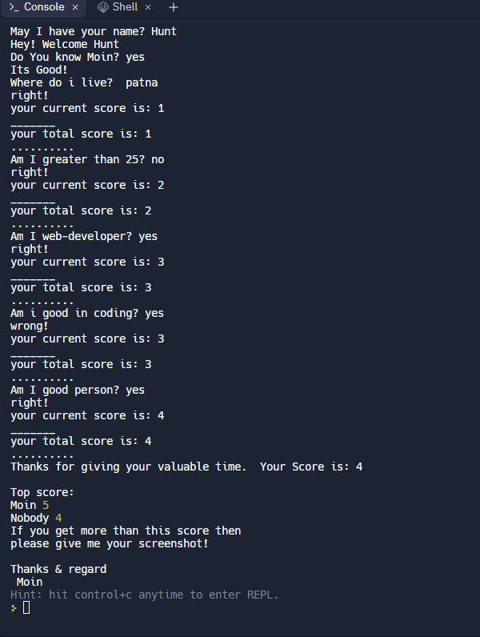

# Project name: How much do you know about me?

Project Description:- In this project, I created a CLI (Command line Interface) App. Which is basically a quiz app bansed an information about me. Through this, I find out how much an another person know about me.

# Information About project:- 

Details about project :- I use _**ReadlineSync**_ for user communication.[Link](https://replit.com/@mdmoinuddin3/Mark-1#index.jsembed=1&output=1)

1. This is basically a fun quiz app.
2. where question is related about me.
3. if you know some question about me, and if it is right then you gain marks.
4. if you don't know question which is about me then you gain nothing.
5. Every right answer marks = 1.
6. wrongh answer , marks = 0

For each correct answer you will be rewarded with 1 points and for incorrect answer you will lose Nothing.
So Don't worry, Just play & fun :)

In the end don't forget to checkout your final score out of 5 points.

 